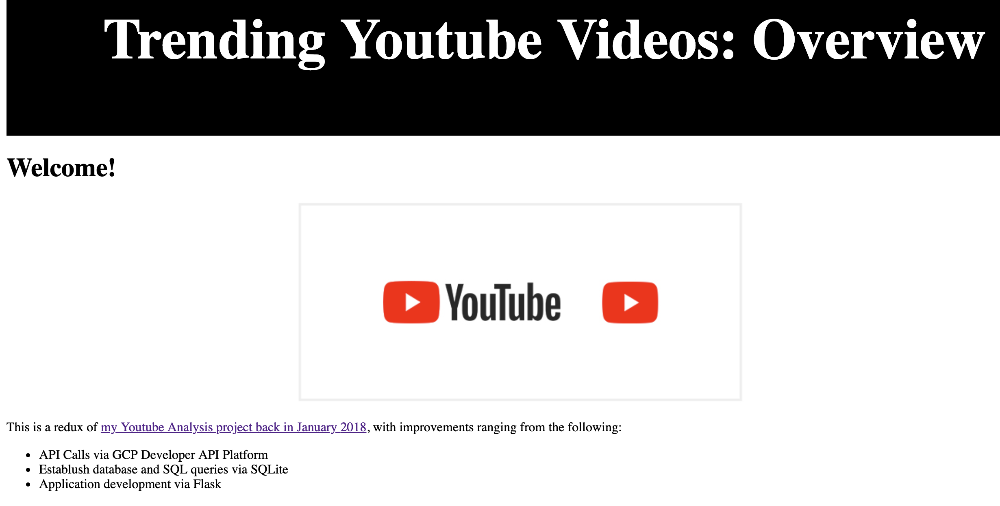
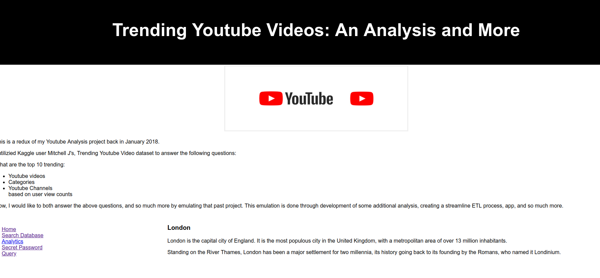
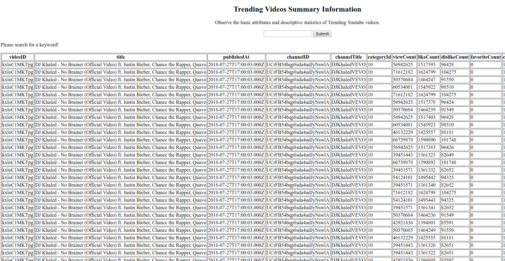

# Youtube Trending Video Analysis

by [Raul Maldonado](https://www.linkedin.com/in/raulm8/)

[Click here to see the deployment via #GCP](https://personal-machine-230918.appspot.com/)

**Table of Contents**

*   [Introduction](#introduction)

*   [Project Demo](#demo)

*   [Directory Infrastructure](#directory)

*   [Resources](#resources)

*   [Deployments](#Deployments)

    *   [Google Cloud Deployment](#GCP) 
    *   [Local Deployment](#local)
    
<a name = "introduction"/>

## Introduction

This is a redux of my [Youtube Analysis project](https://github.com/CloudChaoszero/Youtube-TrendsNMore) back in January 2018. 

I utilizied Kaggle user Mitchell J's, [Trending Youtube Video dataset](https://www.kaggle.com/datasnaek/youtube-new) to answer the following questions:

* What are the top 10 trending

1. Youtube videos

2. Categories

3. Youtube Channels

based on user view counts

Now, I would like to both answer the above questions, and so much more by emulating that past project. This emulation is done through development of some additional analysis, creating a streamline ETL process, app, and so much more.

Enjoy!

<a name = "demo"/>

## Project Demo

### Version 1 (2018)

**Homepage**

**Database Search**

### Version 1 (2018)

<a name = "directory"/>

## (Recommended) Directory Infrastructure

*   Data
    * X number of .csv files outputted from python script

*   Resources
    * config.py file
    * templates
    * Images
*   database.sqlite
*   LegacyData-Imputation.py
*   README.md
*   YoutubeAPI-Interaction.py
*   ytAnalysis-app.py (Flask application)

<a name = "resources"/>

## Resources

*   [Youtube API Documentation](https://developers.google.com/youtube/v3/getting-started)

* [Flask: Quick Start](http://flask.pocoo.org/docs/0.12/quickstart/)

Contact information:

* [LinkedIn](https://www.linkedin.com/in/raulm8/)

* [rmaldonadocloud@gmail.com](mailto:rmaldonadocloud@gmail.com)

<a name = "Deployments"/>

## Deployments

<a name = "GCP"/>

### Google Cloud Deployment

1. Create requirements.txt file
2. Create app.yaml file
3. `gcloud app deploy`
Note: This version uses `main.py` instead of `ytAnalysis-app.py`

<a name = "local"/>

### Running Locally

* If using Flask 0.12.4 or below, use;

`python3 ytAnalysis-app.py`

* If using Flask > 0.12.4 or above, use:

`FLASK_APP=ytAnalysis-app.py flask run`